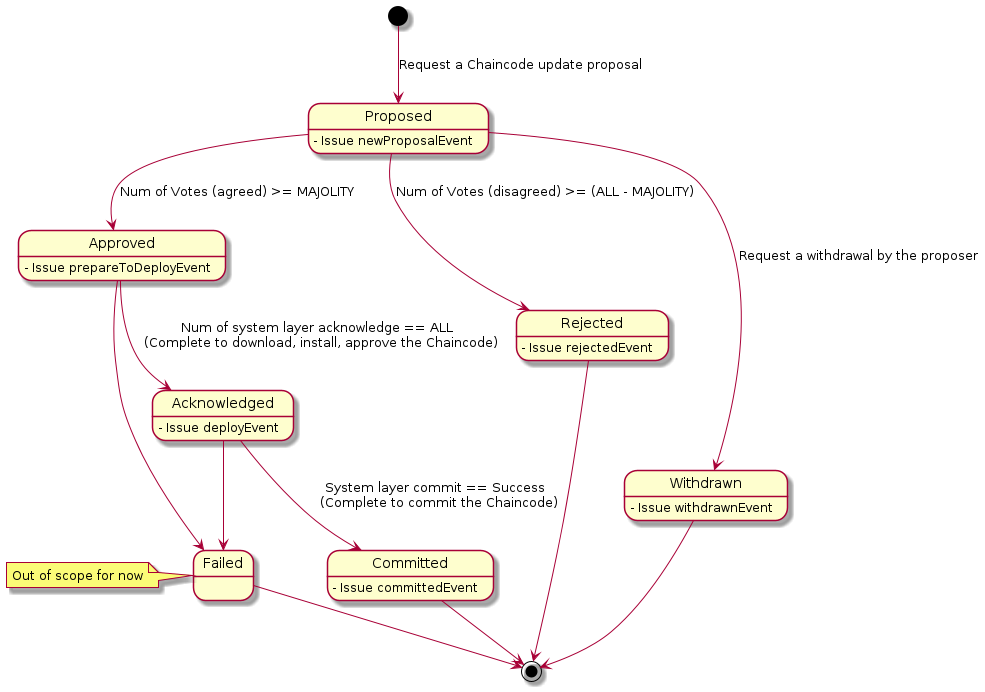

# Design memo for OpsSC

This folder contains design memo about OpsSC.

## Contents

### Design of state transitions for operational proposals in OpsSC

This section describes the current design for the state transitions of operational proposals and the voting functions in OpsSC.
This design has already been applied to `chaincode-ops` and will be applied to `channel-ops` in the future.
The new `chaincode-ops` can now cover a series of state transitions of chaincode update proposals, including proposal rejection and withdrawal, although it is not yet flexible enough. This improvement is a first step and the design will be continuously blushed up in the future.

#### State transitions in chaincode-ops

#### Voting Specifications

- Analysis: differences from real-world voting

  - There is no concept of a voting period
  - A voting system that speeds up decision-making
    - The system that does not wait until everyone has voted

- Voting acceptance specifications

  - Not accept overwriting of votes from the same organization
  - Not accept voting after the decision (should explicitly raise an error)

- Conditions for determining that a vote is `Rejected`
  - Current spec: `agreed` from a MAJOLITY is required to judge the proposal get `Approved`
  - Option 1: Same condition as `Approved`
    - `Rejected` requires `disagreed` from a MAJOLITY
  - Option 2: `Rejected` when `Approved` can no longer be achieved.
    - `Rejected` requires `disagreed` from (total number of organization - (majority of organizations - 1))
  - Currently, select Option 2.
    - To clarify the decision when the number of organizations is an even number.
    - Option 2 can reach the decision faster than Option 1.
